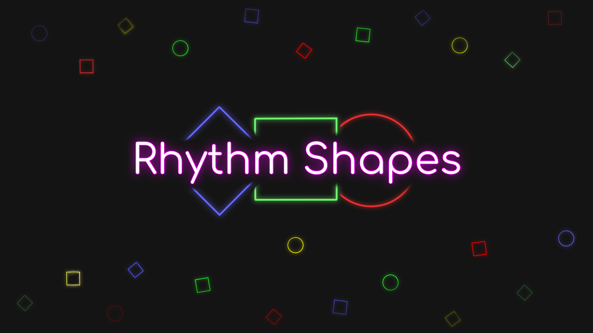

# Rhythm Shapes

## <a name="#description">What is Rhythm Shapes ?</a>
Rhythm Shapes is a student project carried out between September 2022 and February 2023 as part of the JIN course (games and digital interactions).
It is a rhythm game mixing shapes and colors, where the player has to press the right button at the right time in rhythm with the music playing in the background.\
The main goal of this project was to include an algorithm that is able to generate a playable level from any music given by the player.
Some parameters of this algorithm can be modified by players before the analysis, so they can manipulate the difficulty of their levels.\
Finally, Rhythm Shapes also includes a level editor for users that would like to change any detail of their levels.
The editor is very useful to see the results of a music analysis into a zoomable timeline of notes over time, but also to add/remove/change a note and to test the level directly into it before saving it.\
Check out our latest build on [Itch.io](https://ushermay.itch.io/rhythm-shapes).

## <a name="#team">Team</a>
- [Supervisor] Kévin Goilard
- Louka Doz
- Yvon Cocks
- Martial Huot
- Baptiste Santoni
- Paul Vancauwenberghe

# <a name="#assets">External assets</a>
- [Runtime File Browser](https://assetstore.unity.com/packages/tools/gui/runtime-file-browser-113006#description)
- [UniBpmAnalyzer](https://github.com/WestHillApps/UniBpmAnalyzer)
- [Main Music](https://ncs.io/Whatever)
- [Sparkles](https://www.vecteezy.com/vector-art/14320373-star-shine-effects-flash-lights-glare-and-flare)
